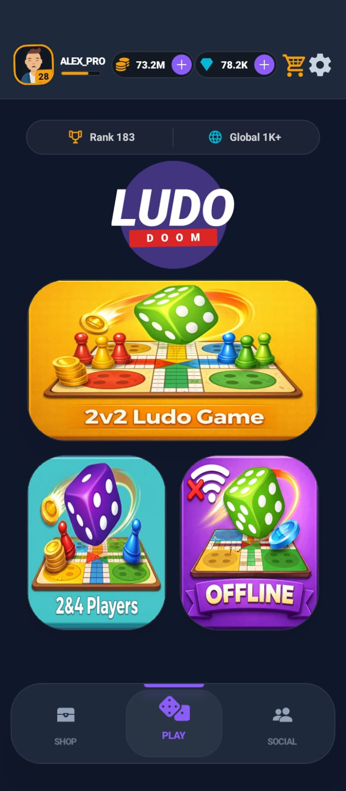
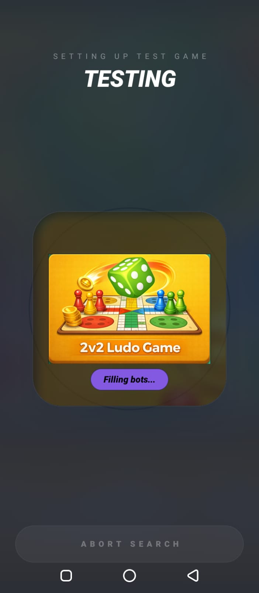
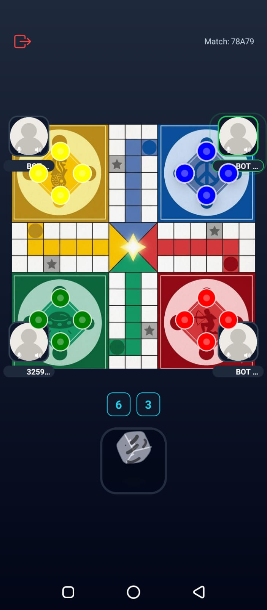
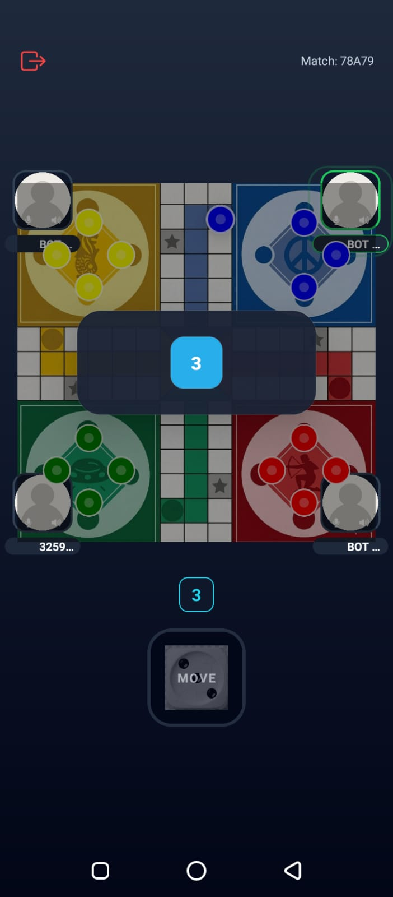
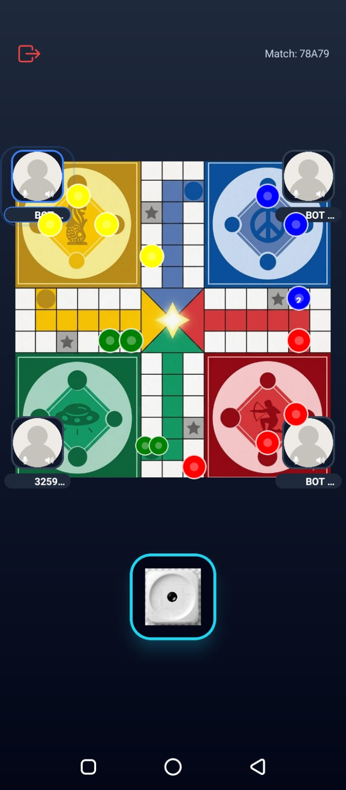

Real-Time Ludo Game App

This app is built with Expo and React Native. It connects to the separate FastAPI WebSocket backend, receives live game updates, and renders the board, pawns, dice, and player status in real time.

Backend repository: [ludo-backend-fastapi](https://github.com/hasan-Khann/Ludo-backend-fastapi)

---

Tech Stack

Expo

React Native

Expo Router

TypeScript

NativeWind

AsyncStorage

Expo Linear Gradient

Expo Vector Icons

React Native Reanimated

Lottie React Native

React Navigation

React Native Screens

---

Features

Real-time multiplayer gameplay

WebSocket connection to the backend

Live game state updates

Dynamic board rotation for each player

Each player sees their home square at a comfortable screen position

Pawn rendering with proper stacking on shared squares

Valid move highlighting

Dice interaction with roll state handling

Turn indicators and player HUDs

Winner overlay when the match ends

Leave match flow with clean socket disconnect

Testing mode for development and debugging at some instinct

---

How the App Works

1. Connect to the backend

When the player opens the game screen, the app connects to the WebSocket server and requests the current game state.

2. Sync game state

The backend sends updates for events such as:

joining a match

rolling dice

moving a pawn

switching turns

leaving a game

finishing the match

3. Render the board

The app updates the board, pawns, dice, and player info from the received state.

4. Rotate the board

The board is rotated based on the local player index so every player gets a natural viewing angle and their own home area appears in a familiar screen corner.

5. Show valid moves

The frontend calculates and highlights valid pawn moves based on the current dice values and game state.

---

Frontend UI Highlights

Board Rotation

Each player sees the board from their own perspective. This makes gameplay easier because every user can view their side of the board in the correct orientation.

Pawn Stacking

When multiple pawns share the same square, the app offsets them visually so they do not overlap completely.

Player HUD

The app shows each player’s turn status, match position, and active player information around the board (needs layout fixes).

Dice Feedback

Dice actions are reflected immediately in the interface so the player can follow the turn without confusion.

Winner Screen

When the game ends, the app shows a winner overlay and offers a return-to-home action.

---

Screenshots

1. 

   

2. 

   

3. 

   

4. 

   

5. 

   

Setup and Running

1. Install dependencies

npm install

2. Start the app

npm run start

3. Run on Android

npm run android

4. Run on iOS

npm run ios

5. Run on Web

npm run web

---

Backend Connection

This frontend depends on the FastAPI WebSocket backend.

Before starting a match, make sure the backend server is running and the socket URL in Utils/socket.ts points to the correct backend endpoint (ip-address/ws).

---

Gameplay Flow

1. The player opens the app.

2. The app connects to the backend through WebSocket.

3. The player joins or resumes a match.

4. The backend sends the current board state.

5. The frontend updates the UI in real time.

6. The player rolls the dice and moves pawns.

7. The backend processes the events and emits the results to frontend UI updates.